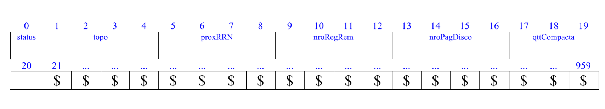
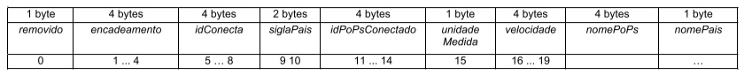

# Trabalhos de Estrura de Dados III

Neste Repositorio estão os trabalhos, feitos em grupo, durante a disciplina de Estrutura de Dados III (SCC0607), 
lecionada pela Docente Cristina Dutra de Aguiar, para o curso de Engenharia de Computação - USP São Carlos.

## Integrantes do Grupo
* Isaac Santos Soares - 12751713
* Nicholas Estevao Pereira de Oliveira Rodrigues Braganca - 12689616

---

## Trabalho 0 - Leitura e Escrita em arquivos binários

Considere os seguintes dados a respeito de uma pessoa:

  **FIRSTNAME** (i.e., primeiro nome da pessoa)
  
  **LASTNAME** (i.e., sobrenome da pessoa) 
  
  **EMAIL** (i.e., endereço com e-mail da pessoa) 
  
  **NATIONALITY** (i.e., país onde a pessoa nasceu) 
  
  **AGE** (i.e., idade)
  
Considere o tipo de arquivo de dados com campos de tamanho fixo em bytes e registros de tamanho fixo em bytes. 
Implemente um programa na linguagem C que ofereça as funcionalidades descritas a seguir.

1. Permita a gravação dos dados de várias pessoas em formato binário. Não é
necessário armazenar todos os registros em memória para escrevê-los em uma única operação, você pode gravar os registros no arquivo a medida em que eles são lidos do teclado.

2. Permita a recuperação dos dados, de todas as pessoas, armazenados no arquivo
de dados, mostrando os dados de forma organizada na saída padrão para permitir a
distinção dos campos e registros.

3. Dado o valor de um RRN (número relativo do registro), recupere o registro
mostrando seus dados de forma organizada na saída padrão para permitir a distinção
dos campos.

### Entrada:

A entrada do programa consiste em um comando a ser executado (1, 2 ou 3), o nome de um arquivo a ser manipulado e entradas adicionais para cada comando:

#### Comando 1:

Recebe o número n de registros a serem lidos da entrada padrão e escritos no arquivo de saída. Além disso, recebe os n registros a serem gravados, cada um com seus campos separados em linhas diferentes.

##### Exemplo:

```
  1 saida.bin 
  1 
  Lucas Romero 
  lucasromero@usp.br
  Brasileiro 20 
```
#### Comando 2: 

Não recebe entrada adicional.

##### Exemplo:

```
  2 entrada.bin
```

#### Comando 3:

Recebe o RRN do registro a ser lido do arquivo. 

##### Exemplo:

```
3 entrada.bin
0
```

### Saídas: 

A saída para os comandos 2 e 3 devem ter o seguinte formato para cada registro printado:

```
Firstname: “primeiro nome do registro escrito aqui”\n 
Lastname: “último nome do registro escrito aqui”\n 
Email: “email do registro escrito aqui”\n 
Nationality: “nacionalidade do registro escrito aqui”\n 
Age: “idade do registro escrito aqui”\n\n 
```

**OBS**: as aspas não estão presentes na saída.
A saída para o comando 1 será feita utilizando a função binarioNaTela, que será fornecida para você utilizar em seu programa. 
Essa função recebe o nome de um arquivo e printa um double calculado utilizando os bytes presentes no arquivo passado como parâmetro.

### Saídas de Erro: 
Erros como arquivos inexistentes e RRNs inválidos devem apresentar saídas diferentes: 
para RRNs inválidos, a saída deverá ser “Não foi possível ler o arquivo”, enquanto que para
arquivos inexistentes a saída deverá ser “Falha no processamento do arquivo”.

### Detalhes: 
1. Os tamanhos dos campos do registro de pessoa são os seguintes: 
    1. Firstname -> 51 bytes 
    2. Lastname -> 51 bytes 
    3. Email -> 81 bytes 
    4. Nationality -> 51 bytes 
    5. Age -> 4 bytes (int) 
2. O ‘\0’ das strings deve ser armazenado no arquivo de dados. 
3. É necessário preencher o espaço restante do campo do registro com um caractere de lixo,
que será o ‘ \$’.

---

## Trabalho 1 - Arquivo de Dados

**Este trabalho tem como objetivo armazenar dados em um arquivo binário, bem como desenvolver funcionalidades para a manipulação desses dados.**

A disciplina de Estrutura de Dados III é uma disciplina fundamental para a disciplina de Bases de Dados. A definição deste primeiro trabalho prático é feita considerando esse aspecto, ou seja, o projeto é especificado em termos de várias funcionalidades, e essas funcionalidades são relacionadas com as funcionalidades da linguagem SQL (Structured Query Language), que é a linguagem utilizada por sistemas gerenciadores de banco de dados (SGBDs) relacionais. As características e o detalhamento de SQL serão aprendidos na disciplina de Bases de Dados. Porém, por meio do desenvolvimento deste trabalho prático, os alunos poderão entrar em contato
com alguns comandos da linguagem SQL e verificar como eles são implementados.

SQL é caracterizada por ser uma linguagem de definição de dados (DDL) e uma linguagem de manipulação de dados (DML). Comandos DDL são aqueles definidos utilizando, por exemplo, CREATE, DROP e ALTER. Comandos DML são aqueles definidos utilizando SELECT, INSERT, DELETE e UPDATE. Alguns desses
comandos estarão presentes ao longo da especificação deste trabalho.

***Os trabalhos práticos têm como objetivo armazenar e recuperar dados relacionados à topologia de rede da Internet. Esses dados são reais, obtidos do
projeto intitulado Internet Tolopogy [Zoo](http://topology-zoo.org/).***

### Descrição Pagina de Disco

No trabalho será usado o conceito de páginas de disco. Cada página de disco tem o tamanho fixo de 960 bytes. Como pode ser observado, o tamanho da página de disco adotado neste trabalho é lógico, sendo adaptado de acordo com os registros de dados
do trabalho.

### Descrição Arquivo de Dados TopologiaRede

Um arquivo de dados possui um registro de cabeçalho e 0 ou mais registros de dados. A descrição do registro de cabeçalho é feita conforme a definição a seguir.

**Registro de Cabeçalho.** O registro de cabeçalho deve conter os seguintes campos:

 * __*status*__: indica a consistência do arquivo de dados, devido à queda de energia, travamento do programa, etc. Pode assumir os valores ‘0’, para indicar que o arquivo de dados está inconsistente, ou ‘1’, para indicar que o arquivo de dados está consistente. Ao se abrir um arquivo para escrita, seu status deve ser ‘0’ e, ao finalizar o uso desse arquivo, seu status deve ser ‘1’ – tamanho: string de 1 byte.

 * __*topo*__: armazena o RRN de um registro logicamente removido, ou -1 caso não haja registros logicamente removidos – tamanho: inteiro de 4 bytes.

 * __*proxRRN*__: armazena o valor do próximo RRN disponível. Deve ser iniciado com o valor ‘0’ e ser incrementado quando necessário – tamanho: inteiro de 4 bytes.

 * __*nroRegRem*__: armazena o número de registros logicamente marcados como removidos. Deve ser iniciado com o valor ‘0’ e deve ser atualizado sempre que
necessário – tamanho: inteiro de 4 bytes.

 * __*nroPagDisco*__: armazena o número de páginas de disco ocupadas pelo arquivo de dados, de acordo com a definição de página de disco feita neste trabalho. Deve ser iniciado com o valor ‘0’ e deve ser atualizado sempre que necessário –
tamanho: inteiro de 4 bytes.

 * __*qttCompacta*__: indica a quantidade de vezes que o arquivo de dados foi compactado. Deve ser iniciado com o valor ‘0’ e deve ser atualizado sempre que
a funcionalidade de compactação for solicitada – tamanho: inteiro de 4 bytes.

**Representação Gráfica do Registro de Cabeçalho.** O tamanho do registro de cabeçalho deve ser o de uma página de disco, representado da seguinte forma:



**Observações Importantes**:

 * O registro de cabeçalho deve seguir estritamente a ordem definida na sua representação gráfica.

 * Os campos são de tamanho fixo. Portanto, os valores que forem armazenados não devem ser finalizados por '\0'.

 * O registro de cabeçalho deve ocupar uma página de disco. Portanto, descontando os campos de tamanho fixo definidos para o registro de cabeçalho, o espaço que sobra deve ser preenchido com o valor ‘ \$’, o qual representa lixo.

**Registros de Dados.** Os registros de dados são de tamanho fixo, com campos de tamanho fixo e campos de tamanho variável. Para os campos de tamanho variável, deve ser usado o método delimitador entre campos. O delimitador é o caractere ‘|’. Os campos de tamanho fixo são definidos da seguinte forma:

 * __*idConecta*__: código identificador do ponto de presença (PoPs) – inteiro – tamanho: 4 bytes. Não pode assumir valores nulos. Pode ter valores repetidos.

 * __*siglaPais*__: sigla do país no qual o PoPs está cadastrado – string – tamanho: 2 bytes. Pode assumir valores nulos. Pode ter valores repetidos.

 * __*idPoPsConectado*__: código identificador do PoPs conectado – tamanho: 4 bytes. Pode assumir valores nulos. Pode ter valores repetidos.
 * __*unidadeMedida*__: unidade de medida da velocidade de transmissão – tamanho: string de 1 byte. Pode assumir valores nulos. Pode ter valores repetidos.

 * __*velocidade*__: velocidade de transmissão – inteiro – tamanho: 4 bytes. Pode assumir valores nulos. Pode ter valores repetidos.

Os campos de tamanho variável são definidos da seguinte forma:

* __*nomePoPs*__: nome do PoPs: string. Pode assumir valores nulos. Pode ter valores repetidos.

 * __*nomePais*__: nome do país por escrito – string. Pode assumir valores nulos. Pode ter valores repetidos.

Adicionalmente, os seguintes campos de tamanho fixo também compõem cada registro. Esses campos de controle são necessários para o gerenciamento de registros logicamente removidos.  

* __*removido*__: indica se o registro está logicamente removido. Pode assumir os valores ‘1’, para indicar que o registro está marcado como logicamente removido, ou ‘0’, para indicar que o registro não está marcado como removido. – tamanho: string de 1 byte.

* __*encadeamento*__: armazena o RRN do próximo registro logicamente removido – tamanho: inteiro de 4 bytes. Deve ser inicializado com o valor -1 quando
necessário.

Os dados são fornecidos juntamente com a especificação deste trabalho prático por meio de um arquivo .csv, sendo que sua especificação está disponível na página da disciplina. No arquivo .csv, o separador de campos é vírgula (,) e o primeiro registro especifica o que cada coluna representa (ou seja, contém a descrição do conteúdo das
colunas).

**Representação Gráfica dos Registros de Dados.** O tamanho dos registros de dados deve ser de 64 bytes. Cada registro de dados deve ser representado da seguinte forma:



**Observações Importantes**: 
 * Cada registro de dados deve seguir estritamente a ordem definida na sua representação gráfica.

 * As strings de tamanho variável são identificadas pelo seu tamanho e, portanto, não devem ser finalizadas com ‘\0’.

 * Os valores nulos nos campos de tamanho fixo devem ser manipulados da seguinte forma. Os valores nulos devem ser representados pelo valor -1 quando forem inteiros ou devem ser totalmente preenchidos pelo lixo ‘ \$’ quando forem do tipo string.

 * Os valores nulos nos campos de tamanho variável devem ser manipulados da seguinte forma: deve ser armazenado apenas o delimitador ‘|’.

 * Deve ser feita a diferenciação entre o espaço utilizado e o lixo. Sempre que houver lixo, ele deve ser identificado pelo caractere ‘ \$’. Nenhum byte do registro deve permanecer vazio, ou seja, cada byte deve armazenar um valor válido ou ‘ \$’.

 * Não existe a necessidade de truncamento dos dados. O arquivo .csv com os dados de entrada já garante essa característica.

 * Os registros de dados não devem ser armazenados na mesma página de disco que o registro de cabeçalho. Adicionalmente, os registros de dados devem ser armazenados em várias páginas de disco, de acordo com a quantidade de registros gerados.

---

## Trabalho 2 - Arquivo de Indice (Arvore B)

---

## Trabalho 3 - Grafos

---
